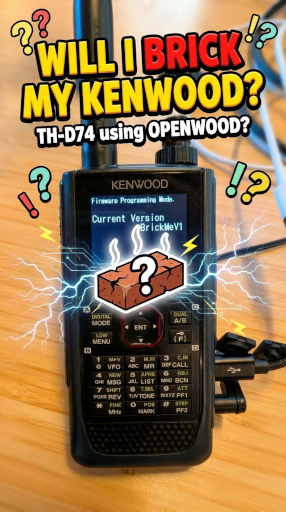
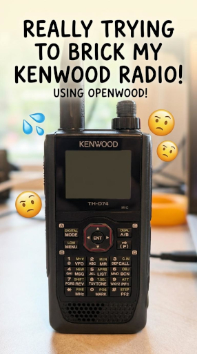

# Openwood

Tools and information for modifying firmware on Kenwood TH-D74 and similar
radios.

The openwood python tool can fully update and recover your Kenwood radio
using official update exe bindles or flash arbitrary custom firmware.
The updater functions on all major OS platforms, GNU/Linux, macOS, and Windows.

Checkout the stress test videos showing that it is hard to brick your radio:

Wiping main firmware section | Flashing faulty firmware
---------------------------- | ------------------------
[](https://youtube.com/shorts/yAGsxllyEVk) | [](https://youtube.com/shorts/kh7Q_Lm4yis)

## Exe Update / Recovery

These steps are intended for updating your radio using an official firmware exe
bundle, from the [Kenwood software downloads] page, OR if you want to transition
from custom firmware back to stock firmware.


1. Make sure that you have
   [`uv` installed](https://docs.astral.sh/uv/getting-started/installation),
   download openwood, and cd into openwood source.
2. Power off the radio

   *Note: If you are recovering from bad firmware, a long power press may not
   work to power the radio off, even if the display appears blank / off.
   You will need to remove the battery and disconnect all external power from the
   radio. Do not reconnect power.*
3. Enter the recovery bootloader

   This is done by holding the `PTT` and `1` buttons, while turning the
   radio on with the power button.

   *Note: If you are recovering from bad firmware, please hold `PTT` and `1`
   while reconnecting either the battery or external power.*

   You should now see the bootloader screen on the radio.
4. Run the following command

   ```bash
   uv run openwood TH-D74_V111_e.exe
   ```

   *Replace `TH-D74_V111_e.exe` with the path to the exe updater from the
   downloaded firmware zip bundle.*

   Once it finishes, you should see a "Complete" message on the radio display.
5. Power off the radio

   Simply press the power button once.

   *This should always work, unless the flashing failed.*
6. Factory reset the radio

   *Kenwood's updater mentions needing to factory reset the radio after a
   firmware update.*

   Hold the `[F]` key while powering on. Select `Full Reset` in the menu.

[Kenwood software downloads]: https://www.kenwood.com/i/products/info/amateur/software_download.html

## Custom Firmware

These steps help you run your own custom program on the radio.
The starter code is in the [`firmware`](firmware) directory.

```bash
apt install build-essential gcc-arm-none-eabi

make -C firmware/hello-world
uv run openwood firmware/hello-world/firmware.bin
```

---

Checkout the [PROTOCOL.md] and [updater.py] for more detail.

[PROTOCOL.md]: PROTOCOL.md
[updater.py]: updater.py

---

Thank you to [@cr](https://github.com/cr) and
[@swiftraccoon](https://github.com/swiftraccoon) for their foundational research
and software contributions. Their work reflects the kind of careful analysis,
technical depth, and persistence that helped make Openwood possible.

You can see some of their amazing work below:

* https://github.com/swiftraccoon/thd75-fw - *Openwood relies on this library*
* https://github.com/cr/thd74
